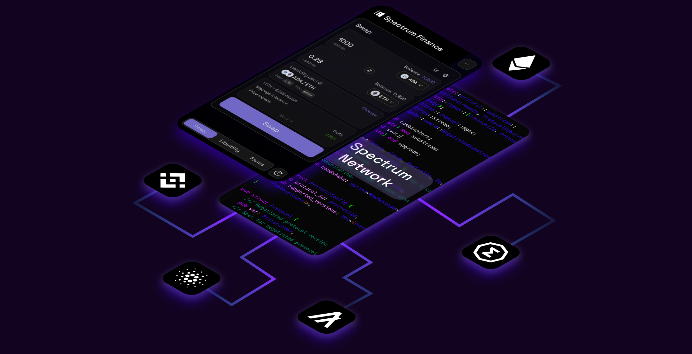

# Spectrum Network

    

This repository contains the reference implementation of the
Spectrum Network protocol, which is a decentralized platform for natively cross-chain apps.

Spectrum website: [https://spectrum.fi/](https://spectrum.fi/)
