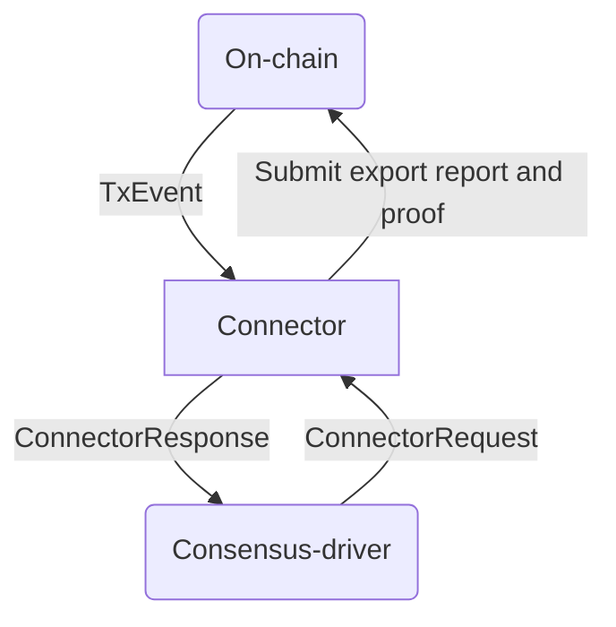
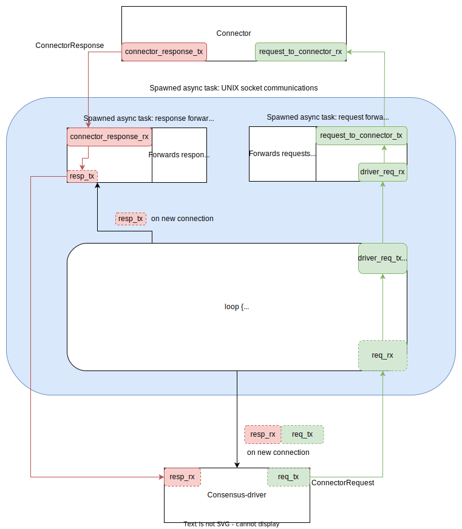

# Spectrum Chain Connector

Chain Connector is a standalone process which exposes a streaming API to Spectrum Node. It works in a
request-response manner over Unix socket IPC. 

**Functionality:**
* Track transactions involving Spectrum Vault (inbound deposits and outbound withdrawals)
  * Convert inbound transactions into Effects
    * Interpret bridge inputs
  * Stream effects
* Assemble and submit outbound transactions
  * Interpret bridge inputs
  
## Streaming API

The consensus-driver and connector communicates over a Unix socket through a simple request-response
protocol. Communication is always initiated by the driver; it sends a request and the connector
responds. The requests that the consensus-driver can make are:
 1. Get the status of the connector
 2. Request on-chain state transitions (appending or rollback of blocks) containing Spectrum-Network
    inbound/outbound transactions from a particular progress point.
 3. Request the connector to determine a suitable subset of outbound transactions from Spectrum-Network
    that can be incorporated into a notarized report. The subset must satisfy various constraints which
    are blockchain-specific.
    1. Once a subset has been identified by the connector, the consensus-driver submits a notarized report
       to be validated by the connector. If validation succeeds, outbound flows of value are released
       from Spectrum-network to recipients as specified in the report.
 4. Request the connector to process deposit UTxOs into the Spectrum-Network Vault.
 5. Request to effect a rotation of the consensus commmittee.



### Rust API

Values of the following enum are sent by the consensus-driver.
```rust
/// Inbound message to Connector from consensus driver. The type parameter `T` represents
/// chain-specific information within the `NotarizedReport`, which is used to validate the
/// withdrawal TX in SN. The parameter `U` represents chain-specific information relating to
/// inbound deposits to SN.
pub enum ConnectorRequest<T, U> {
    /// Indicate to the Connector to start sync'ing from the given progress point. If no
    /// progress point was given, then begin sync'ing from the oldest point known to the vault
    /// manager.
    SyncFrom(Option<ProgressPoint>),
    /// Request the Connector to find a set of TXs to notarize, subject to various constraints.
    RequestTxsToNotarize(NotarizedReportConstraints),
    /// Request the connector to validate the given notarized report and if successful, form and
    /// submit a transaction to export value that's specified in the notarized report.
    ExportValue(Box<NotarizedReport<T>>),
    /// Instruct the Connector form a TX to process outstanding deposits into SN.
    ProcessDeposits,
    /// Acknowledge that TX was confirmed.
    AcknowledgeConfirmedTx(PendingTxIdentifier<T, U>, ProgressPoint),
    /// Acknowledge that TX was aborted.
    AcknowledgeAbortedTx(PendingTxIdentifier<T, U>, ProgressPoint),
    /// Indicate to the Connector to start rotating committee (WIP)
    RotateCommittee,
    /// Indicate to Connector that consensus-driver is disconnecting.
    Disconnect,
}
```

The response of the Connector to an above request is an instance of:

```rust
/// A response from the Connector to the consensus-driver that is sent after a `ConnectorRequest`
/// is received by the Connector.
pub struct ConnectorResponse<S, T, U, V> {
    pub status: ConnectorStatus<S, U>,
    pub messages: Vec<ConnectorMsgOut<T, U, V>>,
}
```

where

```rust
pub enum ConnectorStatus<T, U> {
    /// Indicates that the Connector is sync'ed (up to date) with its associated chain.
    Synced {
        /// The current progress point that the Connector is up to. It represents the
        /// tip of the chain at the time the struct is created.
        current_progress_point: ProgressPoint,
        /// Contains information on a pending TX (withdrawal or deposit), if it currently exists.
        pending_tx_status: Option<PendingTxStatus<T, U>>,
    },

    /// Indicates that the Connector has yet to complete sync'ing with its associated chain.
    Syncing {
        /// The current progress point that the Connector is up to.
        current_progress_point: ProgressPoint,
        /// The number of progress points remaining for the Connector to process to be in sync.
        num_points_remaining: u32,
        /// Contains information on a pending TX (withdrawal or deposit), if it currently exists.
        pending_tx_status: Option<PendingTxStatus<T, U>>,
    },
}

/// Outbound message from the Connector to consensus driver
pub enum ConnectorMsgOut<T, U, V> {
    TxEvent(ChainTxEvent<U, V>),
    ProposedTxsToNotarize(T),
    GenesisVaultUtxo(SValue),
}

pub enum ChainTxEvent<T, U> {
    /// A new set of TXs are made on-chain for a given progress point.
    Applied(SpectrumTx<T, U>),
    /// When the chain experiences a rollback, movements of value must be unapplied.
    Unapplied(SpectrumTx<T, U>),
}

pub struct SpectrumTx<T, U> {
    pub progress_point: ProgressPoint,
    pub tx_type: SpectrumTxType<T, U>,
}

pub enum SpectrumTxType<T, U> {
    /// Spectrum Network deposit transaction that spends deposit UTxOs and transfers its value into
    /// the SN Vault UTxO.
    Deposit {
        /// Value that is inbound to Spectrum-network
        imported_value: Vec<InboundValue<T>>,
        vault_balance: VaultBalance<U>,
    },

    /// Spectrum Network withdrawal transaction
    Withdrawal {
        /// Value that was successfully exported from Spectrum-network to some recipient on-chain.
        exported_value: Vec<TermCell>,
        vault_balance: VaultBalance<U>,
    },

    NewUnprocessedDeposit(InboundValue<T>),
    RefundedDeposit(InboundValue<T>),
}
```


### Message flow with UNIX sockets

There are extra complications when using UNIX sockets for IPC communication in the presence of
repeated connections and disconnections. A common pattern in async Rust applications is to use
message-passing with channels (involving a Sender and Receiver), and such a pattern is used
with UNIX socket communications.

The problem we have here is that the Senders and Receivers associated with a UNIX socket cannot
be reused across multiple openings/closings. Referring to the diagram below, the Senders and
Receivers in dashed-outline only last as long as a given socket is open. Once a driver disconnects,
they can no longer be used. 

We can isolate management of these channels to a separate async task (coloured blue in the diagram)
and an implementer of a connector and consensus-driver need only to create channels
`(connector_response_tx, connector_response_rx)` and `(request_to_connector_tx, request_to_connector_rx)`
on startup of the connector binary.




