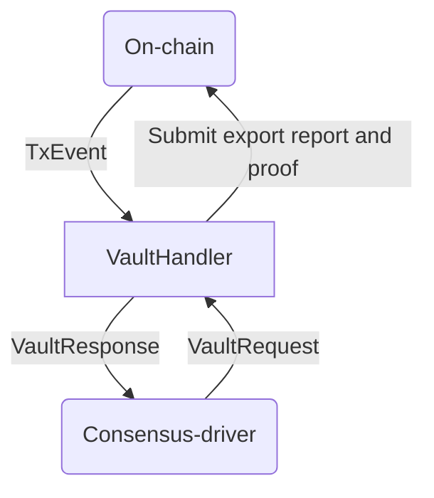

# Spectrum Chain Connector

Chain Connector is a standalone process which exposes a streaming API to Spectrum Node. It works in a
request-response manner over Unix socket IPC. 

**Functionality:**
* Track transactions involving Spectrum Vault (inbound transactions)
  * Convert inbound transactions into Effects
    * Interpret bridge inputs
  * Stream effects
* Assemble and submit outbound transactions
  * Interpret bridge inputs
  
## Streaming API

The consensus-driver and connector communicates over a Unix socket through a simple request-response
protocol. Communication is always initiated by the driver; it sends a request and the connector
responds. The requests that the consensus-driver can make are:
 1. Get the status of the connector
 2. Request on-chain state transitions (appending or rollback of blocks) containing spectrum-network
    inbound/outbound transactions from a particular progress point.
 3. Request the connector to determine a suitable subset of outbound transactions from Spectrum-network
    that can be incorporated into a notarized report. The subset must satisfy various constraints which
    are blockchain-specific.
 4. Submit a notarized report to be validated by the connector. If validation succeeds, outbound
    flows of value are released from Spectrum-network to recipients as specified in the report.
 5. Request to effect a rotation of the consensus commmittee.

