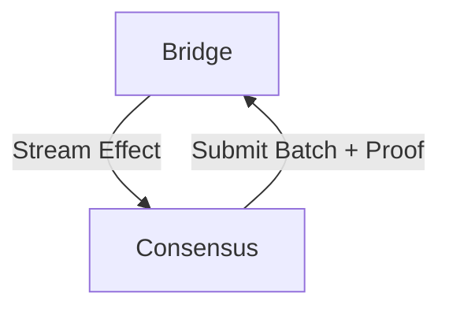

# Spectrum Chain Connector

Chain Connector is a standalone process which exposes streaming API to Spectrum Node.

**Functionality:**
* Track transactions involving Spectrum Vault (inbound transactions)
  * Convert inbound transactions into Effects
    * Interpret bridge inputs
  * Stream effects
* Assemble and submit outbound transactions
  * Interpret bridge inputs

