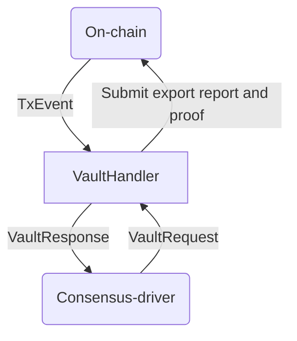

# Spectrum Chain Connector

Chain Connector is a standalone process which exposes a streaming API to Spectrum Node. It works in a
request-response manner over Unix socket IPC. 

**Functionality:**
* Track transactions involving Spectrum Vault (inbound transactions)
  * Convert inbound transactions into Effects
    * Interpret bridge inputs
  * Stream effects
* Assemble and submit outbound transactions
  * Interpret bridge inputs
  
## Streaming API

The consensus-driver and connector communicates over a Unix socket through a simple request-response
protocol. Communication is always initiated by the driver; it sends a request and the connector
responds. The requests that the consensus-driver can make are:
 1. Get the status of the connector
 2. Request on-chain state transitions (appending or rollback of blocks) containing spectrum-network
    inbound/outbound transactions from a particular progress point.
 3. Request the connector to determine a suitable subset of outbound transactions from Spectrum-network
    that can be incorporated into a notarized report. The subset must satisfy various constraints which
    are blockchain-specific.
 4. Submit a notarized report to be validated by the connector. If validation succeeds, outbound
    flows of value are released from Spectrum-network to recipients as specified in the report.
 5. Request to effect a rotation of the consensus commmittee.

### Rust types

Values of the following enum are sent by the consensus-driver.
```rust
pub enum VaultRequest<T> {
    /// Indicate to the vault manager to start sync'ing from the given progress point. If no
    /// progress point was given, then begin sync'ing from the oldest point known to the vault
    /// manager.
    SyncFrom(Option<ProgressPoint>),
    /// Request the vault manager to find a set of TXs to notarize, subject to various constraints.
    RequestTxsToNotarize(NotarizedReportConstraints),
    /// Initiate transaction to settle exported value that's specified in the notarized report.
    ExportValue(Box<NotarizedReport<T>>),
    /// Ackowledge that export TX was confirmed.
    AcknowledgeConfirmedExportTx(Box<NotarizedReport<T>>, ProgressPoint),
    /// Ackowledge that export TX was aborted.
    AcknowledgeAbortedExportTx(Box<NotarizedReport<T>>, ProgressPoint),
    /// Indicate to the vault manager to start rotating committee (WIP)
    RotateCommittee,
}
```

```rust
pub struct NotarizedReportConstraints {
    /// A collection of all pending outbound TXs.
    pub term_cells: Vec<ProtoTermCell>,
    /// The most recent progress point of a TX within `tx_set`.
    pub last_progress_point: ProgressPoint,
    /// Maximum TX size in kilobytes.
    pub max_tx_size: Kilobytes,
    /// An estimate of number of byzantine nodes in the current committee.
    pub estimated_number_of_byzantine_nodes: u32,
}
```

In response the connector sends a value of:
```rust
pub struct VaultResponse<S, T> {
    pub status: VaultStatus<S>,
    pub messages: Vec<VaultMsgOut<T>>,
}
```

where

```rust
pub enum VaultStatus<T> {
    Synced {
        current_progress_point: ProgressPoint,
        pending_export_status: Option<PendingExportStatus<T>>,
    },
    Syncing {
        current_progress_point: ProgressPoint,
        num_points_remaining: u32,
        pending_export_status: Option<PendingExportStatus<T>>,
    },
}

pub enum VaultMsgOut<T> {
    MovedValue(MovedValue),
    ProposedTxsToNotarize(T),
}

pub enum MovedValue {
    /// A new set of TXs are made on-chain for a given progress point.
    Applied(UserValue),
    /// When the chain experiences a rollback, movements of value must be unapplied.
    Unapplied(UserValue),
}
```



