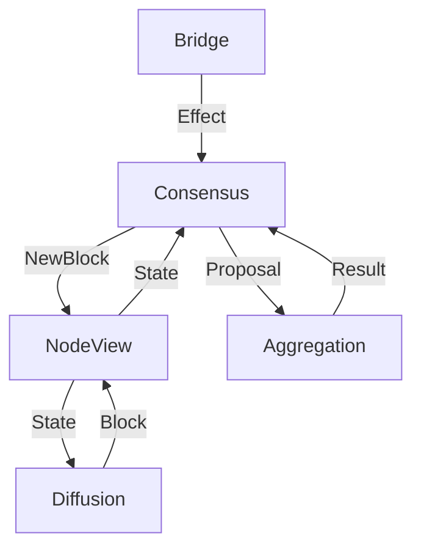
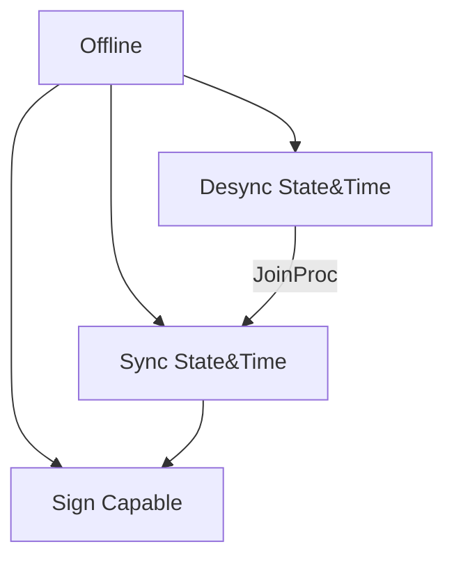

# Consensus Driver

**High level dependency graph overview:**

## Tasks

* Sync State and Time
* Evaluate own roles

## States

## Roles

* Validator
* SlotLeader
* Alert
* Idle

**Combinations of roles:**

* Validator & SlotLeader
* Validator & Alert
* Validator
* Alert
* Idle

## Required procedures

* JoinProc - resynchronization procedure
* FetchInformation - transactions, becons, blocks
* UpdateTime - advance local time
* SelectChain - decide whether any chain is more preferable than the local chain
* ProcessBeacons - record the arrival times of the synchronization beacons
* StakingProcedure - evaluate slot leadership, and potentially create and emit a new block or synchronization beacon
* UpdateStakeDist

## Miner tasks

**If Validator & SlotLeader:**
* Listen to upstream and compose events into reports
* Announce reports
* Perform aggregation (via Aggregation Handler)
* Upon successful aggregation: Compose new block, append to master chain

**If Validator:**
* Listen to upstream and store events in a filter
* Participate in broadcasting
* Perform aggregation (via Aggregation Handler)
* Upon successful aggregation: Deliver notarized reports to the current slot leader
