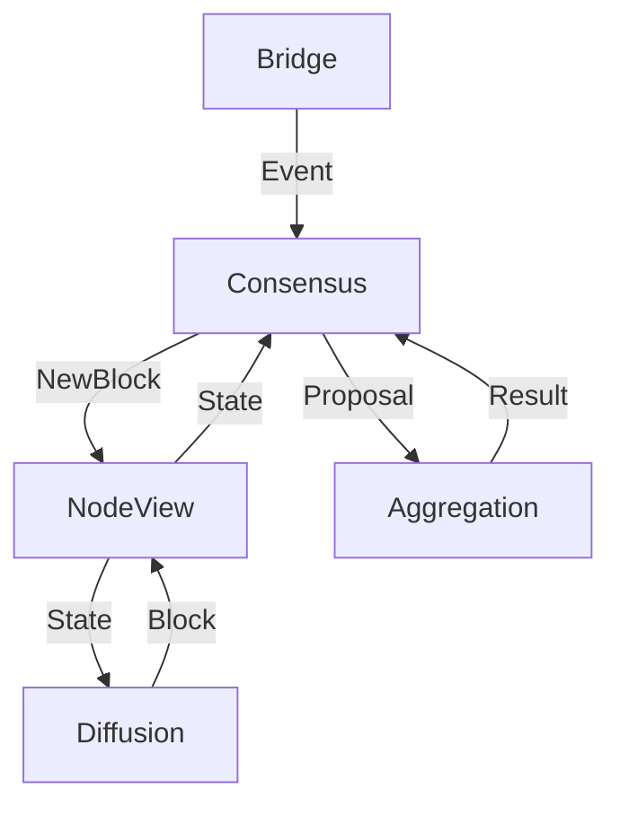

# Consensus Handler

**Functionality (if Local Leader && Global Leader):**
* Listen to upstream and compose events into batches
* Announce batches
* Perform aggregation (via Aggregation Handler)
* Upon successful aggregation: Compose new block, append to master chain

**Functionality (if Local Leader):**
* Listen to upstream and compose events into batches
* Announce batches
* Perform aggregation (via Aggregation Handler)
* Upon successful aggregation: Deliver notarized batches to the global leader

**Functionality:**
* Listen to upstream and store events in a filter
* Participate in broadcasting
* Perform aggregation (via Aggregation Handler)
* Upon successful aggregation: Deliver notarized batches to the global leader
