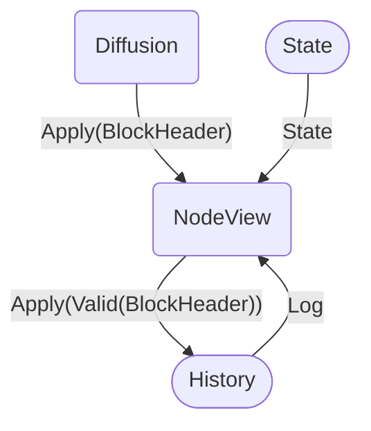
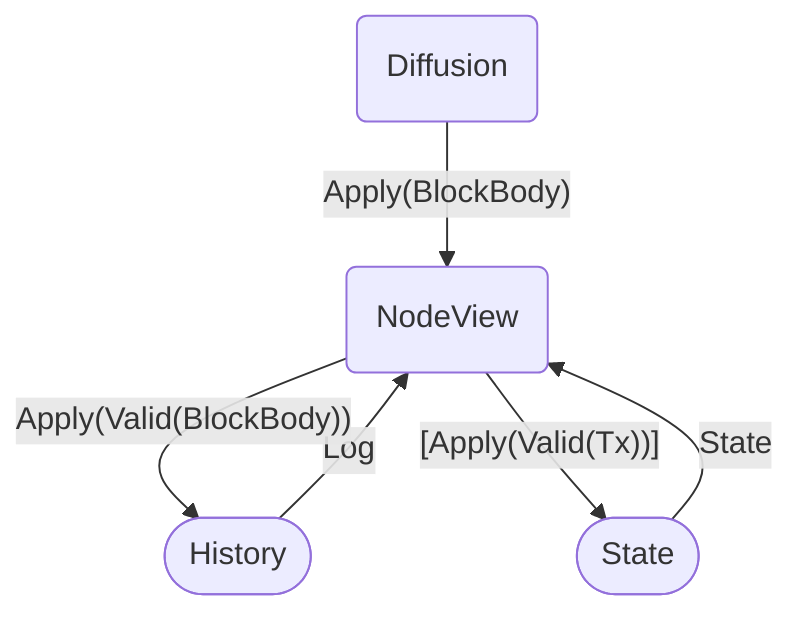

# Modifier Application

**BlockHeader:**

```mermaid
flowchart TD
    D(Diffusion)
    NV(NodeView)
    H([History])
    S([State])
    D-->|"Apply(BlockHeader)"|NV
    H-->|Log|NV
    NV-->|"Apply(Valid(BlockHeader))"|H
    S-->|State|NV
```

**BlockBody:**

```mermaid
flowchart TD
    D(Diffusion)
    NV(NodeView)
    H([History])
    S([State])
    D-->|"Apply(BlockBody)"|NV
    H-->|Log|NV
    NV-->|"Apply(Valid(BlockBody))"|H
    S-->|State|NV
    NV-->|"[Apply(Valid(Tx))]"|S
```
