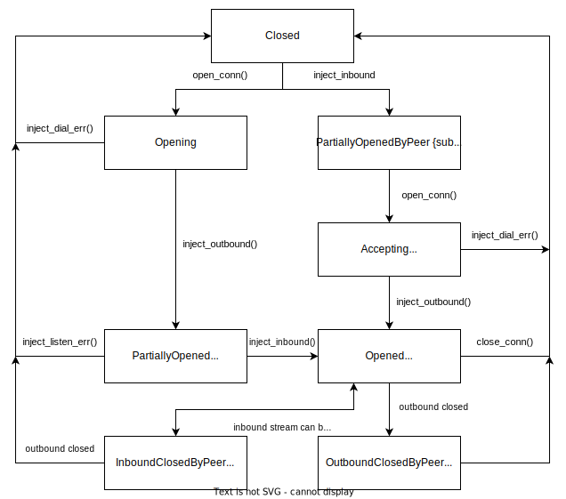
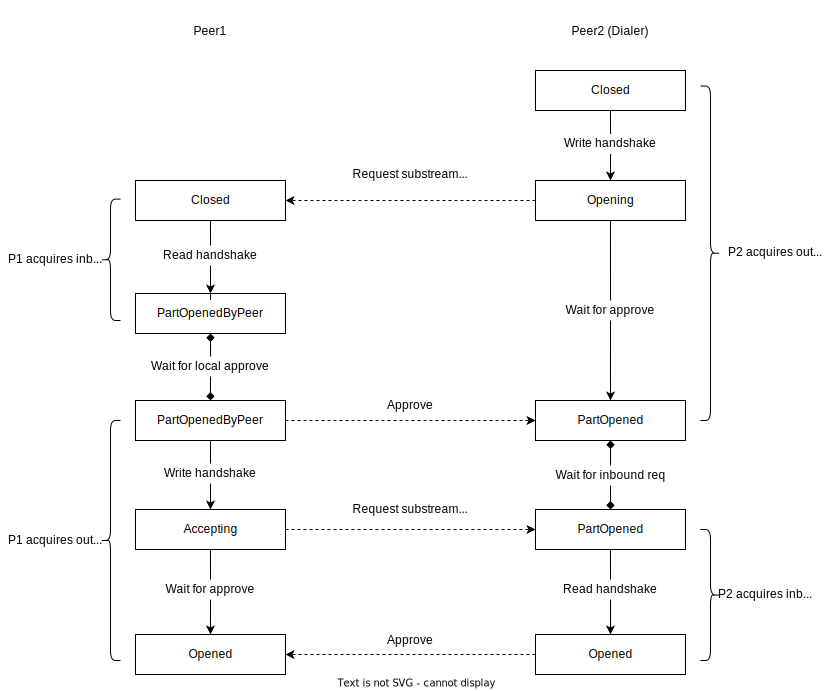
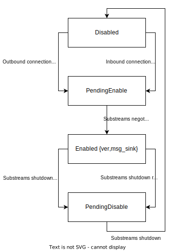

# Spectrum Networking Layer

## Peer Connection Handler

Peer Connection Handler (PCH) is responsible for handling protocol substreams for a particulal peer. PCH keeps track of the
states of all supported protocols at each point of upgrade flow:

Protocol negotiation flow in terms of state transitions on both peers:

## Peer Manager

Peer Manager (PM) tracks states and reputation of all peers. PM decides who to connect who our node should connect to, 
approves/rejects incoming connections based on features and reputation of peers.

## Network Controller

Network Controller (NC) syncronises behaviours of libp2p swarm, PCH for each connection and PM. In order to do that NC 
has to track a projection of states of enabled protocols (only the relevant information, thus this set of states is 
more narrow than the one in PCH):

