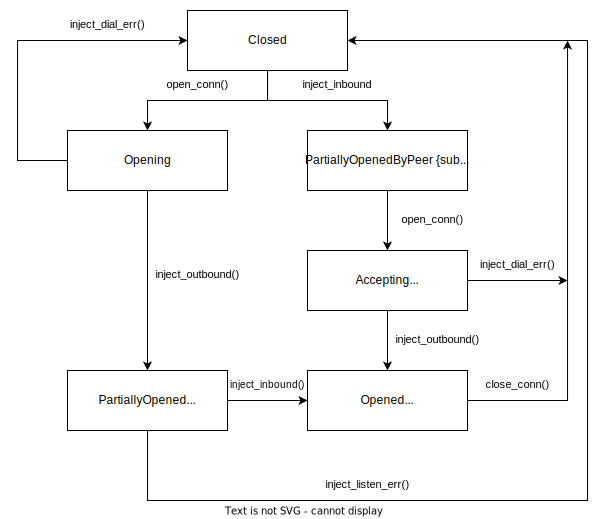

# Spectrum Networking Layer

## Peer Connection Handler

Peer Connection Handler (PCH) is responsible for handling protocol substreams for a particulal peer. PCH keeps track of the
protocol state at each point of upgrade flow.

