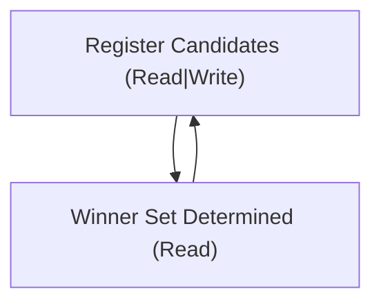
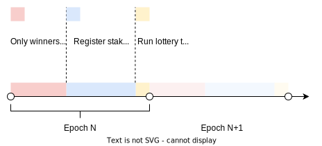

# On-chain Lottery for Roll-DPoS Consensus

A decentralized on-chain lottery protocol for Roll-DPoS Consensus.

## Problem statement

Roll-DPoS Consensus requires a resilient way of randomly choosing a set of validators for a predefined period of time.

## Solution

A decentralized lottery allowing to choose a set of validators to participate in decentralized consesnsus for a certain
period of time via on-chain lottery.

## Protocol description

We introduce a new primitive - a lottery contract. Lottery contact secures Lottery Box, which keeps Lottery State.

Fig. 1. Lottery states

### Lottery parameters

| Param               | Type      | Description                                                           |
|---------------------|-----------|-----------------------------------------------------------------------|
| `updateWindowLen`   | `Integer` | Length of a read-only window for seamless pool updates                |
| `registerWindowLen` | `Integer` | Length of a window when register for the next lottery is open         |
| `computeWindowLen`  | `Integer` | Length of a window withing which it's allowed to compute next matcher |
| `setSize`           | `Integer` | Size of validator set                                                 |
| `ticketPrice`       | `Integer` | Price of one ticket                                                   |
| `acceptedCurrency`  | `TokenId` | ID of the accepted currency                                           |

### Lottery state

| Param                  | Type      | Description                                                                          |
|------------------------|-----------|--------------------------------------------------------------------------------------|
| `pendingEpoch`         | `Integer` | Index of the pending epoch (for which the matcher will be selected via this lottery) |
| `winnerTicketRangeMin` | `Integer` | Index of the min winner ticket                                                       |
| `winnerTicketRangeMax` | `Integer` | Index of the max winner ticket                                                       |
| `ticketRangeMin`       | `Integer` | Index of the first ticket sold in this round                                         |
| `ticketRangeMax`       | `Integer` | Index of the last ticket sold in this round                                          |

### Protocol bootstrap

1. A new lottery box is created with a unique NFT as an identifier, ticket tokens, an initial set of validators
   (their PKs) and lottery settings (see "Lottery parameters")
2. ID of the LotteryNFT is fixed as a consesnsus protocol parameter

### Main protocol flow

Fig. 2. Main protocol flow

1. Users willing to serve the network register in the lottery. To do that they buy lottery tickets at the defined
   price rate `ticketPrice` of `acceptedCurrency` tokens per ticket. In return to their tokens which are locked in
   the lottery box they receive tickets bundled with the starting index of the sold tickets `{rangeMin: Integer}`.
2. Once previous epoch comes to an end lower and upper winner ticket indexes are computed as
   `winnerTicketRangeMin = Hash(Seed) mod (ticketRangeMax - ticketRangeMin)`
   and `winnerTicketRangeMax = winnerTicketRangeMin + setSize` and is assigned to the corresponding lottery
   state variable.
3. Once the next epoch begins a determined set of validator PKs for the epoch is copied to consensus state box from
   winner ticket bundles. Lottery box
   witnesses the index of the winner ticket.
4. Other tickets are used to redeem collaterals.

Fig. 2. Lottery timeline

## Acquiring on-chain entropy

On-chain entropy can be acquired from an oracle. 