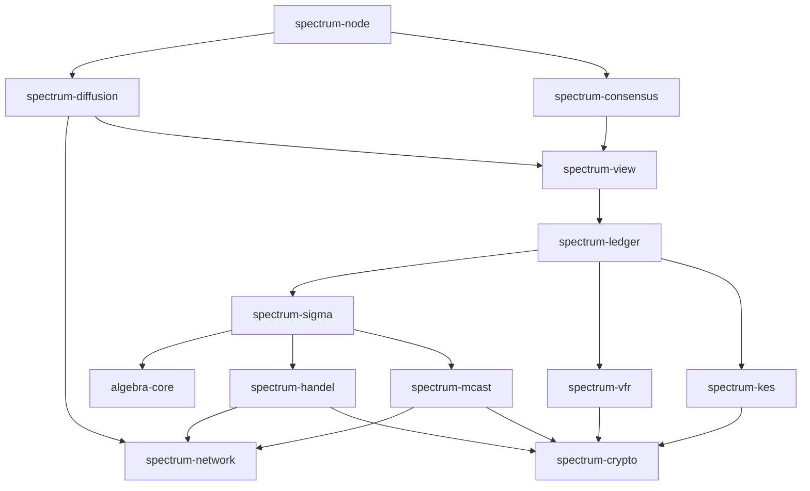

# Project Structure

**Crates:**

* `algebra-core` - Higher order abstractions
* `spectrum-network` - Networking framework
* `spectrum-mcast` - Impl of multicasting protocol
* `spectrum-handel` - Impl of Handel protocol
* `spectrum-diffusion` - Impl of diffusion protocol
* `spectrum-crypto` - Common crypto primitives
* `spectrum-ledger` - Ledger models and types
* `spectrum-vfr` - VRF impl
* `spectrum-kes` - KES impl
* `spectrum-sigma` - Impl of Sigma Aggregation protocol
* `spectrum-view` - View of the ledger state
* `spectrum-consensus` - Consensus rules
* `spectrum-node` - Wired Node App

**Dependency graph:**

