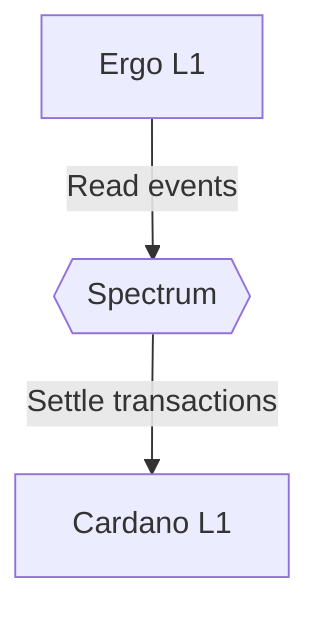

# Abstract

# Protocol overview
Spectrum is a standalone protocol that allows a large set of nodes to agree on:
1. A set of events coming from supported L1 chains
2. A set of actions with on-chain assets managed by the network

Assets managed by the Network are stored on-chain in ***vaults***. Each vault stores epoch number $n$, an aggregated public key $aPK_n$ of the current validator set $V_n$ and is guarded with a script capable of performing verification of an aggregated signature $verify: (σ_n, m_n, aPK_n) → 0 | 1$.

## Protocol flow

### Validators nomination
1. (Trusted) Initialize vaults with $PK_0$ corresponding to an initial set of validators $V_0$
2. Candidates register in the lottery for epoch $E_1$ by publishing their public keys $PK_c$ and locking collateral
3. Once registry period is passed the set of candidates for $E_1$ is determined
4. Nodes in $V_0$ compute public random number $R_1$
5. Nodes in $V_0$ compute $selectVSet: (C_1, R_1) → V_1$
6. Nodes in $V_0$ compute $aggrPK: (V_1) → aPK_1$
7. Nodes in $V_0$ form a cross-chain message $m_1$ containing $aPK_1$
8. Nodes in $V_0$ start to aggregate collective signature of $M_1$ 
9. Once $2/3$ signatures are aggregated, signature $σ_1$ is published along with $m_1$ on-chain
10. Epoch in on-chain vaults is updated $Vault\{(E_0, aPK_0)\} := (E_1, aPK_1)$, $(m_1, σ_1)$ is used as a witness
11. Next round starts from (2)

## Spectrum's State Transition Function
Usually State Transition Function (STF) of a ledger looks like $apply: (S, T) → S'$, where $S$ - current state of the ledger, $T$ - a set of transactions, $S'$ - resulting state of the ledger. 
Spectrum's STF as long as it operates partially on top of other ledgers, can be viewed as $apply: (S, S_O, T_I) → (S', T_O)$, where $S$ - current Spectrum's state, $S_O$ - observed outbound state of connected ledgers, $T_I$ - a set of inbound transactions, $S'$ - resulting state of spectum's ledger, $T_O$ - resulting set of outbound transactions that must be settled on connected L1s.

### Achieving finality of outbound transactions
Most ledgers do not guarantee instant finality of transaction, that means that any (or all) transactions of $T_0$ may not be applied to corresponding ledgers in the end.

## Handling L1 Fees
Spectrum partially operates 