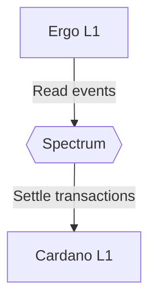

# Abstract
Following the success of Bitcoin, many blockchain-based cryptocurrencies have been developed and deployed. To meet different requirements in various scenarios, a great number of heterogeneous blockchains have emerged. However, most of present blockchain platforms are isolated systems. Therefore, interoperability between blockchains become one of the key issues
that prevent the blockchain technology from wide adoption.

# Model

# Protocol overview
Spectrum is a standalone protocol that allows a large set of nodes to agree on:
1. A set of events coming from supported L1 chains
2. A set of actions with on-chain assets managed by the network

Assets managed by the Network are stored on-chain in ***vaults***. Each vault stores epoch number $n$, an aggregated public key $aPK_n$ of the current validator set $V_n$ and is guarded with a script capable of performing verification of an aggregated signature $verify: (σ_n, m_n, aPK_n) → 0 | 1$.

## Bootstrapping
The system is bootstrapped in a trusted way. A manually picked set of validators $V_0$ is assigned to the first epoch $E_0$. On-chain vaults are initialized with an aggregated public key $aPK_0$ of the inititial comettee.

## Protocol 
1. Registration. Before an epoch starts, all Spectrum stakeholders can register for becoming an committee member. To get a chance of becoming a member of $V_n$ in the next epoch $E_n$ they register in a lottery by publishing their public keys $PK_c$ and locking collateral.
2. Lottery. Once registration is done, nodes in $V_{n-1}$ compute $selectComettee: (C_n, R_n) → V_n$, where  $C_n$ is a candidates pool, $R_n$ is a public random number. 
3. Public key aggregation. Once new comettee is selected, nodes in $V_n$ aggregate their individual public keys $\{PK_i\}$ into a joint one $aPK_n$.
4. Comettee transition. Nodes in $V_{n-1}$ publish cross-chain message $M_n : (aPK_n, σ_{n-1})$ , where $aPK_n$ is an aggregated public key of the new comettee $V_n$ , $σ_{n-1}$ is an aggregated signature of $M_n$ such that $Verify(σ_{n-1}, aPK_{n-1}, Mn) = 1$. Vaults are updated such that $Vault\{(E_{n-1}, aPK_{n-1})\} := (E_n, aPK_n)$.

## Spectrum's State Transition Function
Usually State Transition Function (STF) of a ledger looks like $apply: (S, T) → S'$, where $S$ - current state of the ledger, $T$ - a set of transactions, $S'$ - resulting state of the ledger. 
Spectrum's STF as long as it operates partially on top of other ledgers, can be viewed as $apply: (S, S_O, T_I) → (S', T_O)$, where $S$ - current Spectrum's state, $S_O$ - observed outbound state of connected ledgers, $T_I$ - a set of inbound transactions, $S'$ - resulting state of spectum's ledger, $T_O$ - resulting set of outbound transactions that must be settled on connected L1s.

### Achieving finality of outbound transactions
Most ledgers do not guarantee instant finality of transaction, that means that any (or all) transactions of $T_0$ may not be applied to corresponding ledgers in the end.

## Handling L1 Fees
Most of L1 blockchains require non-zero fee to be paid in order for the transaction to be accepted by the network. Thus, to commit outbound transactions Spectrum should always maintain enough native cryptocurrecncy on each connected chain.